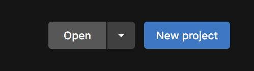
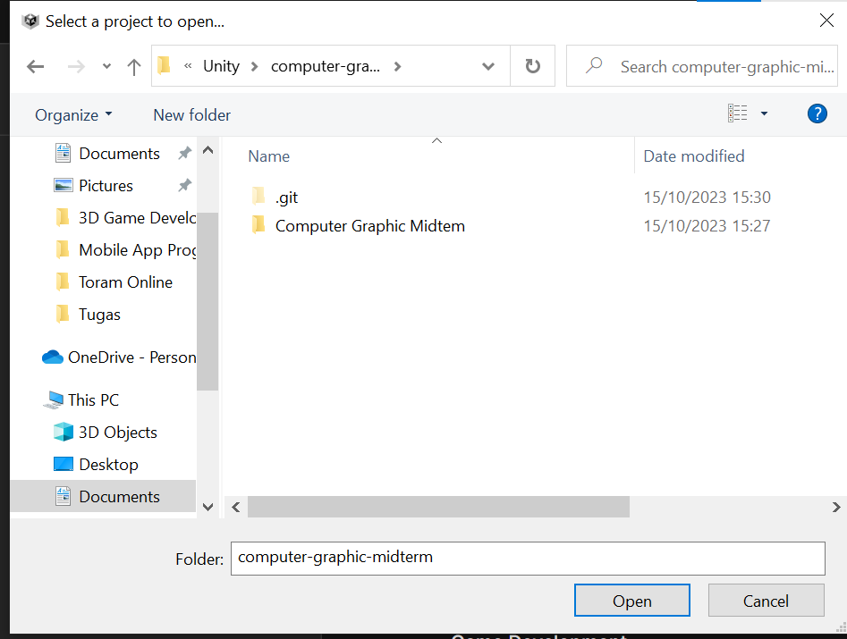
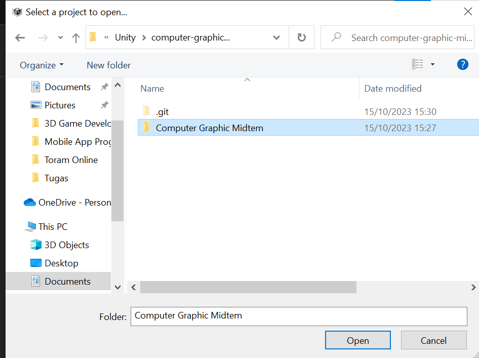
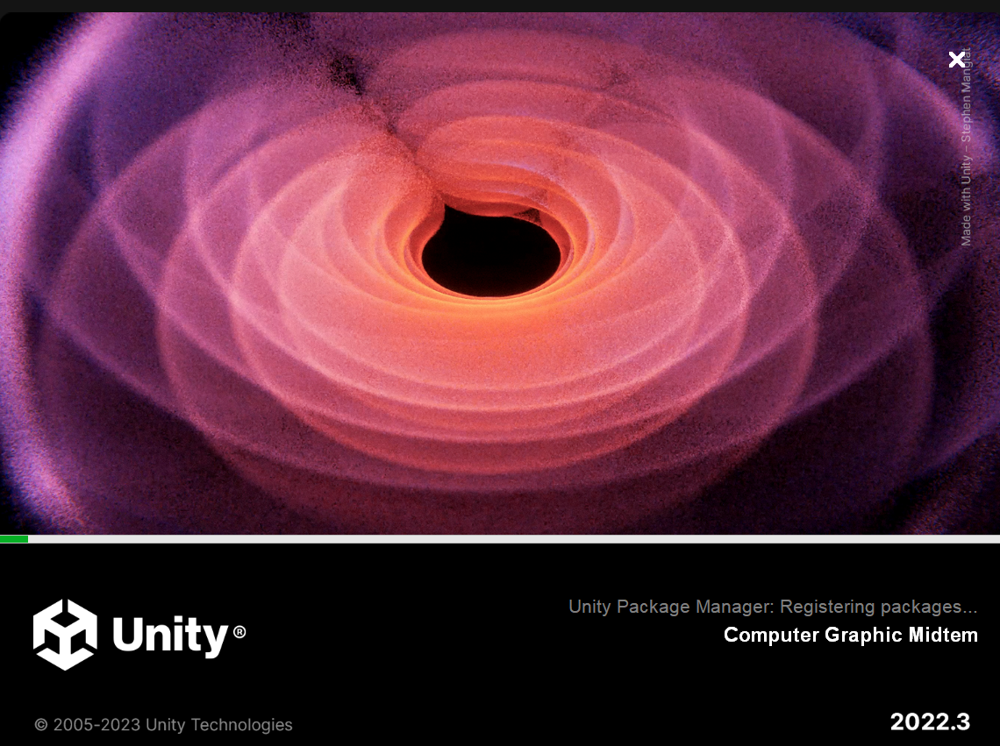

# computer-graphic-midterm
Midterm Exam for Computer Graphic &amp; Animation

## How to open this project on unity?
on unityhub: 
1. click open -> locate this project -> Computer Graphics Midterm folder -> click ok/open

2. locate this github project

3. select the Computer Graphics Midterm folder and click open

4. Then wait until unity editor open
